# KCET College Predictor

**An intelligent, application that helps students navigate Karnataka Common Entrance Test (KCET) college admissions through AI-powered counseling, real-time data analysis, and personalized recommendations.**

---

## Table of Contents

- [What This Solves](#what-this-solves)
- [Features](#features)
- [System Architecture](#system-architecture)
- [Technology Stack](#technology-stack)
- [Agentic AI System](#agentic-ai-system)
- [Contributing](#contributing)
- [License](#license)

## What This Solves

Every year, thousands of students struggle with KCET counseling due to:
- Complex cutoff trends across multiple rounds
- Difficulty finding suitable colleges based on rank
- Lack of personalized guidance
- Overwhelming data from 1000+ colleges across 20+ engineering branches

**Solution:**
- Real-time college predictions based on KCET rank
- AI-powered conversational counseling
- Automated analysis reports via email
- Advanced filtering and comparison tools
- Historical cutoff trend analysis

## Features

### Core Functionality

- **Rank-Based Prediction**: Find colleges accessible based on KCET rank with configurable round selection
- **Branch-Wise Search**: Explore colleges offering specific engineering branches with cutoff analysis
- **Advanced Filtering**: Multi-parameter search with rank ranges, branch preferences, and sorting
- **College Comparison**: Side-by-side comparison of multiple colleges with detailed metrics
- **Cutoff Trends**: Historical cutoff data across all counseling rounds
- **Fuzzy Matching**: Intelligent search handles abbreviations (e.g., "RV" matches "RV College of Engineering")

### AI-Powered Counseling

The AI counselor uses Google Gemini 2.5 Flash with function calling to autonomously query the database and provide personalized guidance. The agent has access to 18 specialized tools across four categories:

- **Data Retrieval**: Get colleges by rank, branch, or advanced filters; retrieve cutoff trends and branch listings; analyze branch popularity
- **Smart Matching**: Fuzzy search for college names handling abbreviations; intelligent branch name matching (CS, ECE, AIML, etc.)
- **Analysis Tools**: Statistical analysis of student prospects; side-by-side college comparisons
- **Email Automation**: Comprehensive reports with college matches and analysis; prediction summaries, comparisons, and counseling guidance

**Key Capabilities:**
- Autonomous tool selection based on student queries
- Multi-tool execution for complex requests
- Conversation context retention across sessions
- Zero-confirmation policy for high-confidence matches

## System Architecture

```mermaid
graph TB
    subgraph "Client Layer"
        Browser[Web Browser]
        Mobile[Mobile Browser]
    end

    subgraph "Frontend - React Application"
        React[React 19.1 + TypeScript]
        Vite[Vite Build Tool]
        MUI[Material-UI Components]
        Router[React Router]
        AuthContext[Auth Context]
    end

    subgraph "Backend - FastAPI Server"
        FastAPI[FastAPI Application]
        REST[REST API Endpoints]
        WS[WebSocket Handler]
        Middleware[CORS & Auth Middleware]
    end

    subgraph "AI Agent System"
        Agent[AI Agent Core]
        Gemini[Google Gemini 2.5 Flash]
        Tools[Tool Registry - 18 Tools]
        Prompts[System Prompts]
        SessionMgr[Session Manager]
    end

    subgraph "Data Layer"
        SQLite[(SQLite Database<br/>KCET 2024 Data)]
        SessionStore[Session Storage<br/>JSON Files]
    end

    subgraph "External Services"
        Supabase[Supabase Auth]
        SMTP[SMTP Email Service]
        Gmail[Gmail SMTP]
    end

    subgraph "Email System"
        EmailService[Email Service]
        Templates[Jinja2 Templates]
        Reports[Report Generator]
    end

    Browser --> React
    Mobile --> React
    React --> Vite
    React --> MUI
    React --> Router
    React --> AuthContext
    
    React -->|REST API| REST
    React -->|WebSocket| WS
    AuthContext -->|OAuth| Supabase
    
    REST --> FastAPI
    WS --> FastAPI
    FastAPI --> Middleware
    
    FastAPI --> Agent
    Agent --> Gemini
    Agent --> Tools
    Agent --> Prompts
    Agent --> SessionMgr
    
    Tools --> SQLite
    SessionMgr --> SessionStore
    
    Agent --> EmailService
    EmailService --> Templates
    EmailService --> Reports
    EmailService --> SMTP
    SMTP --> Gmail
    
    style React fill:#61DAFB
    style FastAPI fill:#009688
    style Gemini fill:#4285F4
    style SQLite fill:#003B57
    style Supabase fill:#3ECF8E
```

## Technology Stack

### Backend

- **FastAPI** 0.109.0+ - Web framework
- **Python** 3.11+ - Programming language
- **SQLite** - Database with KCET 2024 data
- **Google Gemini** 2.5 Flash - AI model with function calling
- **Pydantic** v2 - Data validation
- **Jinja2** 3.1.0+ - Email template engine
- **WebSockets** - Real-time communication
- **Supabase** 2.24.0 - Authentication

### Frontend

- **React** 19.1 - UI library
- **TypeScript** 5.9 - Type-safe JavaScript
- **Vite** 7.1+ - Build tool
- **Material-UI** v5 - Component library
- **Axios** 1.12+ - HTTP client
- **React Router** 7.9+ - Routing
- **React Markdown** 10.1+ - Markdown rendering

## Agentic AI System

The AI counselor is built on an agentic architecture where the language model autonomously decides which tools to use and when to use them.

### Agent Architecture

The AI agent operates in a continuous loop:
1. User Input - Student asks a question in natural language
2. Reasoning - AI analyzes the query and determines required actions
3. Tool Selection - Selects appropriate functions from the tool registry
4. Execution - Calls tools with extracted parameters
5. Result Processing - Receives structured data from tools
6. Response Generation - Formulates natural language response with data
7. Iteration - May call multiple tools in sequence for complex queries

### Autonomous Behavior

The system prompt enforces strict rules:
- Zero Confirmation Policy - AI proceeds automatically with high-confidence matches
- Tool-First Execution - Never promises actions without executing them
- Context Retention - Remembers rank and preferences across conversation
- Smart Extraction - Auto-derives student name from email, rank from history
- Multi-Step Completion - Executes all required tools without user intervention

### Real-Time Communication

WebSocket implementation provides:
- Streaming responses with chunked delivery
- Thinking indicators showing AI reasoning steps
- Tool call notifications for transparent execution
- Error handling with graceful fallbacks

## Documentation

- [API Documentation](API_DOCUMENTATION.md) - Complete API reference
- [Database Schema](SCHEMA.md) - Database structure and schema
- [Contributing Guide](CONTRIBUTING.md) - Development setup and guidelines

## Contributing

We welcome contributions! Please see [CONTRIBUTING.md](CONTRIBUTING.md) for:
- Development environment setup
- Code style guidelines
- Pull request process
- Testing guidelines

## License

This project is licensed under the MIT License - see the [LICENSE](LICENSE) file for details.

---

**Built with FastAPI, React, and Google Gemini AI**

